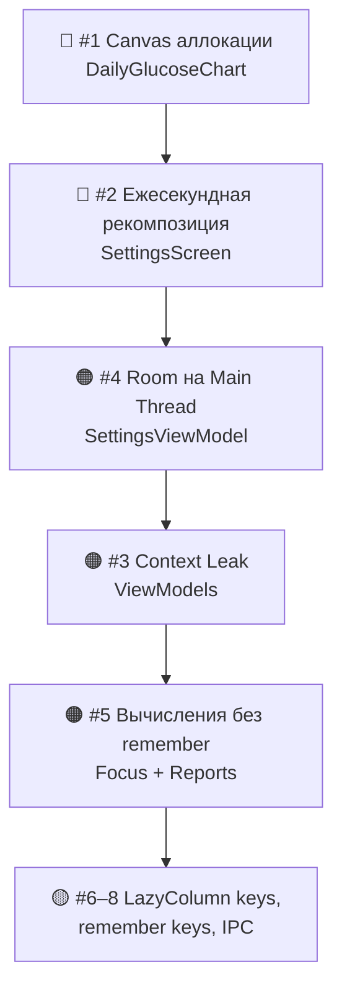

# 🔍 Аудит производительности TIRUp — Финальный отчёт

> Дата: 2026-09-15  
> Ветка: `main` (1 unpushed commit)

---

## Сводная таблица проблем

| # | Критичность | Категория | Файл | Краткое описание |
|---|---|---|---|---|
| 1 | 🔴 **Critical** | UI Jank + GC Pressure | [DailyGlucoseChart.kt](file:///d:/Users/physicist/Desktop/ken/TIRUp/app/src/main/java/com/tirup/app/presentation/focus/DailyGlucoseChart.kt#L848-L1450) | Аллокации `Paint()`, `Path()`, `PathEffect`, `floatArrayOf`, фильтрация коллекций **внутри Canvas DrawScope** на каждый кадр (60–120 FPS) |
| 2 | 🔴 **Critical** | Battery Drain | [SettingsScreen.kt](file:///d:/Users/physicist/Desktop/ken/TIRUp/app/src/main/java/com/tirup/app/presentation/settings/SettingsScreen.kt#L320-L326) | Бесконечный `while(true) { delay(1000) }` в корне экрана → полная рекомпозиция ~6000 строк каждую секунду |
| 3 | 🟠 **High** | Memory Leak | [FocusViewModel.kt](file:///d:/Users/physicist/Desktop/ken/TIRUp/app/src/main/java/com/tirup/app/presentation/focus/FocusViewModel.kt#L41-L46), [SettingsViewModel.kt](file:///d:/Users/physicist/Desktop/ken/TIRUp/app/src/main/java/com/tirup/app/presentation/settings/SettingsViewModel.kt#L56-L62) | Удержание `Context` (Activity) в ViewModel с подавлением `@SuppressLint("StaticFieldLeak")` |
| 4 | 🟠 **High** | ANR / Main Thread IO | [SettingsViewModel.kt](file:///d:/Users/physicist/Desktop/ken/TIRUp/app/src/main/java/com/tirup/app/presentation/settings/SettingsViewModel.kt#L147-L175) | Синхронный Room DAO `getReadingsBetweenSync` на `Dispatchers.Main` |
| 5 | 🟠 **High** | UI Jank | [ReportsScreen.kt](file:///d:/Users/physicist/Desktop/ken/TIRUp/app/src/main/java/com/tirup/app/presentation/reports/ReportsScreen.kt#L258-L263), [FocusScreen.kt](file:///d:/Users/physicist/Desktop/ken/TIRUp/app/src/main/java/com/tirup/app/presentation/focus/FocusScreen.kt#L482-L483) | `minOfOrNull`/`maxOfOrNull` по тысячам точек + создание `SimpleDateFormat` без `remember` |
| 6 | 🟡 **Medium** | UI Jank | [FocusScreen.kt](file:///d:/Users/physicist/Desktop/ken/TIRUp/app/src/main/java/com/tirup/app/presentation/focus/FocusScreen.kt#L2672-L2673) | `items(logs.size)` без `key` в LazyColumn |
| 7 | 🟡 **Medium** | Stale UI | [FocusScreen.kt](file:///d:/Users/physicist/Desktop/ken/TIRUp/app/src/main/java/com/tirup/app/presentation/focus/FocusScreen.kt#L196-L203), [FocusScreen.kt](file:///d:/Users/physicist/Desktop/ken/TIRUp/app/src/main/java/com/tirup/app/presentation/focus/FocusScreen.kt#L1865-L1870) | Неполные ключи `remember` (пропущены `unit`, `durationDays`) |
| 8 | 🟡 **Medium** | IPC Overhead | [FocusViewModel.kt](file:///d:/Users/physicist/Desktop/ken/TIRUp/app/src/main/java/com/tirup/app/presentation/focus/FocusViewModel.kt#L213-L221) | `NotificationManager.notify()` при любом изменении настроек, даже без обновления сахара |

---

## Детальное описание и решения

### 🔴 1. Canvas DrawScope: аллокации на каждый кадр

**Файл:** [DailyGlucoseChart.kt:848–1450](file:///d:/Users/physicist/Desktop/ken/TIRUp/app/src/main/java/com/tirup/app/presentation/focus/DailyGlucoseChart.kt#L848-L1450)

**Проблема:**  
Внутри блока `Canvas { ... }` (вызывается 60–120 раз/сек при жестах) создаются:
- Новые `android.graphics.Paint()` — `gapPaint`, `insulinPaint`, `carbsPaint`, `notePaint`, `yLabelPaint`
- Новые `Path()` — `solidPath`, `forecastPath`
- `PathEffect.dashPathEffect(floatArrayOf(...))` — 11 вызовов с новыми массивами
- Фильтрация `todayReadings.filter { ... }`, `insulinClusters.filter { ... }` и т.д.

Это **главная причина микрофризов** при скролле графика: шквал короткоживущих объектов → GC pauses → jank.

**Решение:**
```kotlin
// Вынести в Composable-уровень
val solidPath = remember { Path() }
val forecastPath = remember { Path() }
val dash6_6 = remember { PathEffect.dashPathEffect(floatArrayOf(6f, 6f), 0f) }
val dash4_8 = remember { PathEffect.dashPathEffect(floatArrayOf(4f, 8f), 0f) }
val dash8_4 = remember { PathEffect.dashPathEffect(floatArrayOf(8f, 4f), 0f) }

val textPaint = remember(color) {
    Paint().apply {
        this.color = color.toArgb()
        textSize = 20f
        isAntiAlias = true
        typeface = Typeface.DEFAULT_BOLD
    }
}

// Фильтрацию вынести в derivedStateOf / remember(readings, window)
val visibleReadings = remember(todayReadings, windowStartMinute, visibleMinutes) {
    todayReadings.filter { it.minuteOfDay in windowStartMinute..(windowStartMinute + visibleMinutes) }
}

// Внутри Canvas:
Canvas(modifier = Modifier.matchParentSize()) {
    solidPath.reset()  // переиспользовать, не создавать новый
    forecastPath.reset()
    // рисование без new Paint() / new Path() / new floatArrayOf
}
```

---

### 🔴 2. Ежесекундная рекомпозиция всего SettingsScreen

**Файл:** [SettingsScreen.kt:320–326](file:///d:/Users/physicist/Desktop/ken/TIRUp/app/src/main/java/com/tirup/app/presentation/settings/SettingsScreen.kt#L320-L326)

**Проблема:**
```kotlin
var currentTimeMs by remember { mutableStateOf(System.currentTimeMillis()) }
LaunchedEffect(Unit) {
    while (true) {
        delay(1000L)
        currentTimeMs = System.currentTimeMillis()
    }
}
```
`currentTimeMs` используется только на строке ~1537 для обратного отсчёта BLE-моста, но state объявлен в корне экрана → **весь экран (~6000 строк) рекомпозируется каждую секунду**. Это постоянная утилизация CPU и расход батареи.

**Решение:**  
Изолировать таймер в отдельный минимальный Composable:
```kotlin
@Composable
fun BleCountdownBadge(nextDueMs: Long, modifier: Modifier = Modifier) {
    var now by remember { mutableStateOf(System.currentTimeMillis()) }
    LaunchedEffect(nextDueMs) {
        while (true) { delay(1000L); now = System.currentTimeMillis() }
    }
    val diffSec = ((nextDueMs - now) / 1000L).coerceAtLeast(0L)
    Text(text = "${diffSec}s", modifier = modifier)
}
```

---

### 🟠 3. Утечка Activity Context в ViewModels

**Файлы:**  
- [FocusViewModel.kt:41–46](file:///d:/Users/physicist/Desktop/ken/TIRUp/app/src/main/java/com/tirup/app/presentation/focus/FocusViewModel.kt#L41-L46)
- [SettingsViewModel.kt:56–62](file:///d:/Users/physicist/Desktop/ken/TIRUp/app/src/main/java/com/tirup/app/presentation/settings/SettingsViewModel.kt#L56-L62)

**Проблема:**  
Оба ViewModel хранят `Context` в поле и подавляют предупреждение `@SuppressLint("StaticFieldLeak")`. При повороте экрана старая Activity утекает.

**Решение:**  
Использовать `AndroidViewModel(application)` и `getApplication<Application>().applicationContext`.

---

### 🟠 4. Room DAO на главном потоке

**Файл:** [SettingsViewModel.kt:147–175](file:///d:/Users/physicist/Desktop/ken/TIRUp/app/src/main/java/com/tirup/app/presentation/settings/SettingsViewModel.kt#L147-L175)

**Проблема:**  
`getReadingsBetweenSync` вызывается внутри `viewModelScope.launch { ... }` (Dispatchers.Main). Дисковый I/O блокирует UI-поток.

**Решение:**  
Обернуть в `withContext(Dispatchers.IO) { ... }`.

---

### 🟠 5. Тяжелые вычисления без `remember`

**Файлы:**  
- [ReportsScreen.kt:258–263](file:///d:/Users/physicist/Desktop/ken/TIRUp/app/src/main/java/com/tirup/app/presentation/reports/ReportsScreen.kt#L258-L263) — `minOfOrNull`/`maxOfOrNull` + `SimpleDateFormat` без мемоизации
- [FocusScreen.kt:482–483](file:///d:/Users/physicist/Desktop/ken/TIRUp/app/src/main/java/com/tirup/app/presentation/focus/FocusScreen.kt#L482-L483) — `minOf`/`maxOf` без `remember`
- [FocusScreen.kt:2674](file:///d:/Users/physicist/Desktop/ken/TIRUp/app/src/main/java/com/tirup/app/presentation/focus/FocusScreen.kt#L2674) — `SimpleDateFormat` на каждую рекомпозицию

**Решение:**  
Обернуть в `remember(key) { ... }`.

---

### 🟡 6. LazyColumn без стабильных ключей

**Файл:** [FocusScreen.kt:2672–2673](file:///d:/Users/physicist/Desktop/ken/TIRUp/app/src/main/java/com/tirup/app/presentation/focus/FocusScreen.kt#L2672-L2673)

**Решение:** `items(items = logs, key = { it.timestamp }) { ... }`

---

### 🟡 7. Неполные ключи `remember`

- [FocusScreen.kt:196–203](file:///d:/Users/physicist/Desktop/ken/TIRUp/app/src/main/java/com/tirup/app/presentation/focus/FocusScreen.kt#L196-L203) — пропущен `durationDays`
- [FocusScreen.kt:1865–1870](file:///d:/Users/physicist/Desktop/ken/TIRUp/app/src/main/java/com/tirup/app/presentation/focus/FocusScreen.kt#L1865-L1870) — пропущен `unit`

---

### 🟡 8. Избыточные IPC-обновления уведомлений

**Файл:** [FocusViewModel.kt:213–221](file:///d:/Users/physicist/Desktop/ken/TIRUp/app/src/main/java/com/tirup/app/presentation/focus/FocusViewModel.kt#L213-L221)

**Решение:**  
Запоминать `lastNotifiedTimestamp` и вызывать `updateLockscreenNotification` только при реальном изменении показания сахара.

---

## Рекомендуемый порядок исправления



> [!IMPORTANT]
> Проблемы **#1** и **#2** — главные причины микрофризов и расхода батареи. Их исправление даст **наибольший ощутимый эффект** для пользователя.

---

## Затронутые файлы (6 штук)

| Файл | Проблемы |
|---|---|
| [DailyGlucoseChart.kt](file:///d:/Users/physicist/Desktop/ken/TIRUp/app/src/main/java/com/tirup/app/presentation/focus/DailyGlucoseChart.kt) | #1 |
| [SettingsScreen.kt](file:///d:/Users/physicist/Desktop/ken/TIRUp/app/src/main/java/com/tirup/app/presentation/settings/SettingsScreen.kt) | #2 |
| [FocusViewModel.kt](file:///d:/Users/physicist/Desktop/ken/TIRUp/app/src/main/java/com/tirup/app/presentation/focus/FocusViewModel.kt) | #3, #8 |
| [SettingsViewModel.kt](file:///d:/Users/physicist/Desktop/ken/TIRUp/app/src/main/java/com/tirup/app/presentation/settings/SettingsViewModel.kt) | #3, #4 |
| [FocusScreen.kt](file:///d:/Users/physicist/Desktop/ken/TIRUp/app/src/main/java/com/tirup/app/presentation/focus/FocusScreen.kt) | #5, #6, #7 |
| [ReportsScreen.kt](file:///d:/Users/physicist/Desktop/ken/TIRUp/app/src/main/java/com/tirup/app/presentation/reports/ReportsScreen.kt) | #5 |
