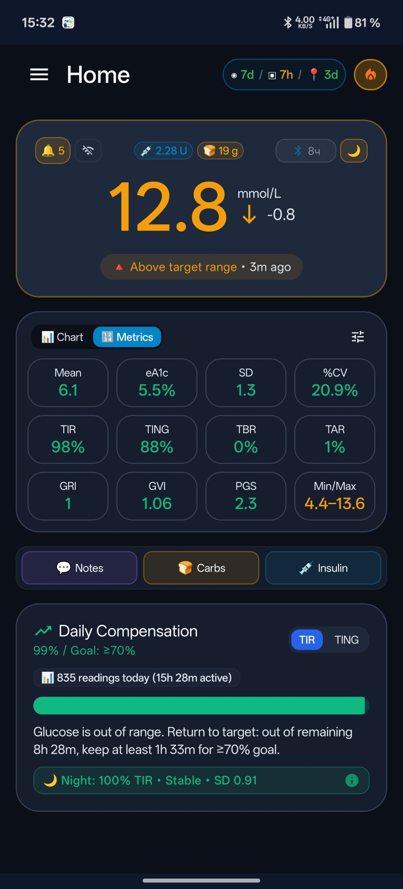
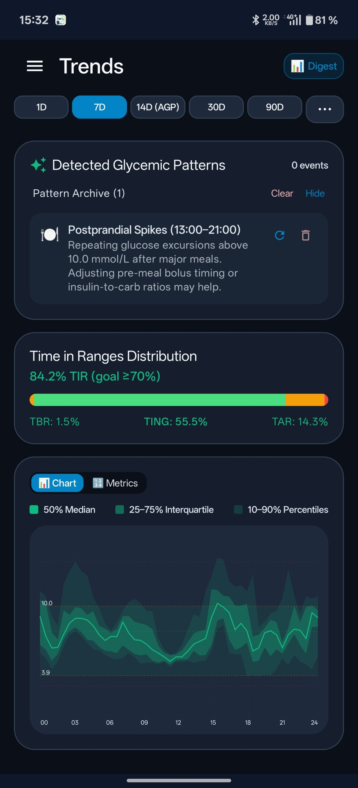
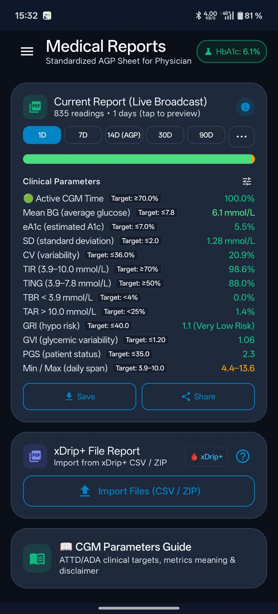
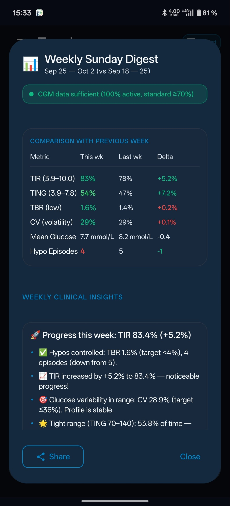
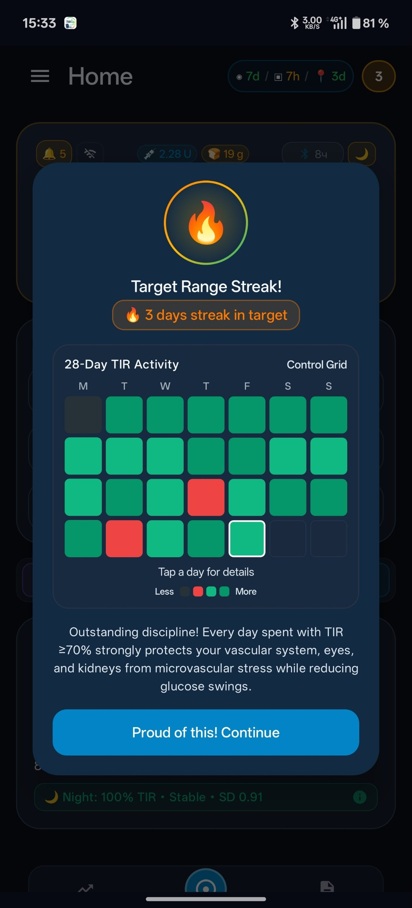
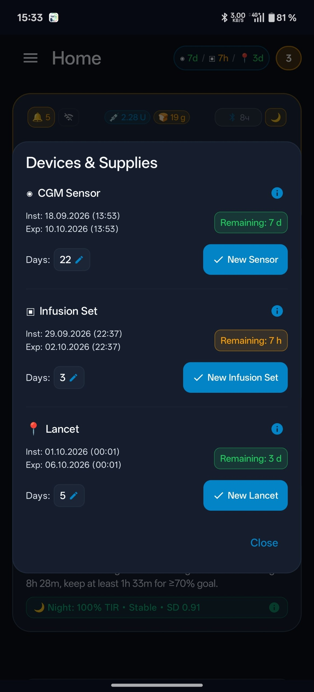
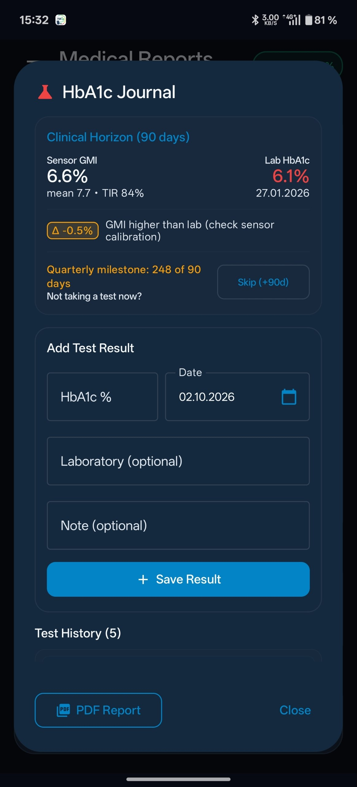
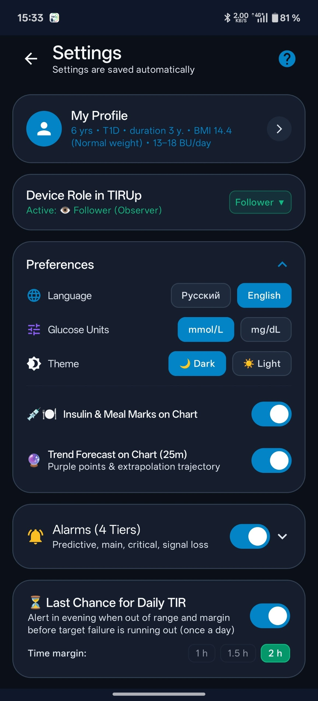
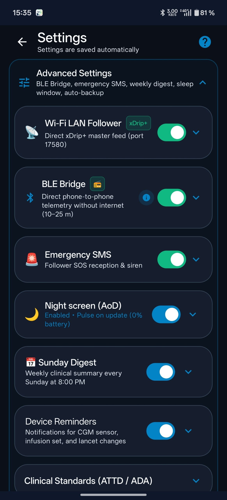
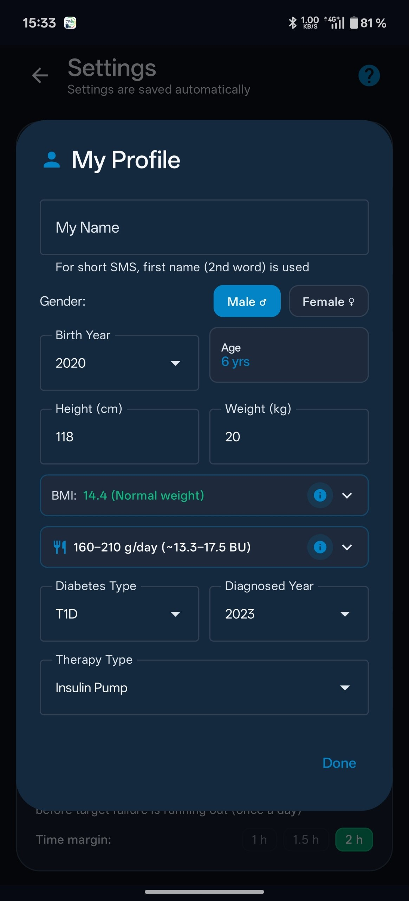

# TIRUp (Time-In-Range Up) 🩸📈

<div align="center">


**TIRUp** is an advanced, privacy-first, 100% offline open-source Android application for Continuous Glucose Monitoring (CGM) analytics, emergency safety alerts, and automated clinical AGP (Ambulatory Glucose Profile) medical reporting.

[ 🇬🇧 English ](#tirup-time-in-range-up-) • [ 🇷🇺 Перейти к русской версии ](#russian-version)

[ 🌟 Key Features ](#key-features) • [ 📸 Screenshots ](#ui-screenshots) • [ 📱 Data Sources ](#data-sources) • [ 📊 Clinical Metrics ](#clinical-metrics) • [ 🛠 Tech Stack ](#tech-stack) • [ 🏗 Building ](#building) • [ ⚠️ Medical Disclaimer ](#disclaimer)

</div>

---

<a name="ui-screenshots"></a>
## 📸 UI Screenshots

<div align="center">

| Home & Real-Time Monitoring | Glycemic Trends & AGP | Clinical PDF Reports |
| :---: | :---: | :---: |
|  |  |  |
| **Hero Glucose & Metrics Grid** | **Trends, Ranges & 24h AGP Curve** | **Standardized AGP PDF Export** |

<br/>

| Weekly Digest Analysis | TIR Streak & Activity Grid | Supplies & Devices Tracker |
| :---: | :---: | :---: |
|  |  |  |
| **Week-over-Week Insights** | **Target Range Consistency** | **Sensors, Cannulas & Lancets** |

<br/>

| Laboratory HbA1c Journal | Master / Follower Roles | Advanced Hardware Settings |
| :---: | :---: | :---: |
|  |  |  |
| **Lab HbA1c vs 90d GMI** | **Caregiver Roles & Daily Target** | **LAN Follower, BLE Bridge & SOS** |

<br/>

| Patient Profile & Settings |
| :---: |
|  |
| **Clinical Profile & Daily Carb Target** |

</div>

---

<a name="key-features"></a>
## 🌟 Key Features

### 1. Autonomous Real-Time Ingestion (100% Offline)
- Direct interception of local broadcast intents from **xDrip+** (`com.eveningoutpost.dexdrip.BgEstimate`).
- Reception of active insulin (**IoB**), active carbohydrates (**CoB**), and bolus/food history via the **Broadcast Service API**.
- Operates 100% locally on your smartphone — **no internet connection, external cloud servers, or risks of medical telemetry leaks**.

### 2. Direct xDrip+ Polling via Wi-Fi / Hotspot (LAN Follower, 100% Offline)
- Direct local HTTP polling of the master device's xDrip+ web server (`http://<master_ip>:17580`) with `API Secret` authentication.
- Polls `sgv.json` (glucose, trend arrow), `pebble` (active insulin IoB, active carbohydrates CoB, master device battery 🔋), and `treatments.json` (boluses, carbs, fingerstick calibrations, notes with persistent UUIDs).
- Fully functional without an active internet connection (over home Wi-Fi or the master device's Hotspot).
- **Subnet Auto-Discovery**: parallel background coroutine scan across addresses `192.168.x.1`–`254` and Hotspot gateway `192.168.43.1` completed in ~1.2 seconds. Battery protection: scanning is blocked (no-op) when Wi-Fi is disconnected.
- **Unified Deduplication Matrix**: single ingestion point into Room DB with strict source priority (`LOCAL_XDRIP` [4] → `BLE_BRIDGE` [3] → `WIFI_LAN` [2] → `NIGHTSCOUT_CLOUD` [1]) and safe field enrichment (`iob`, `cob`, `trendArrow`).
- **HeroGlucoseCard Status Chip Strip**: balanced row of chips `[Bell 🔔]` → `[Wi-Fi icon]` → `[Master Battery 🔋 %]` → `[IoB 💉]` → `[CoB 🍞]` → `[BLE Bridge 📡]` → `[AoD 🌙]`. Compact 28x24 dp dimensions without clutter, dynamic color shifts based on live status, and responsive layout across any screen width. Tapping the Wi-Fi chip opens a status dialog with a manual subnet scan trigger.

### 3. Quick Treatments Entry & Nightscout API Cloud Sync
- Convenient quick-entry sheet on the Home screen for logging bolus insulin doses 💉, carbohydrates 🍞, fingerstick calibrations 🩸, and notes 💬.
- Background sync to the Nightscout REST API (`POST /api/v1/treatments`) with support for `api-secret` (SHA-1) or query token authorization.
- **Persistent UUID Deletion (`DELETE /api/v1/treatments/{uuid}`)**: deleting a treatment record in TIRUp cancels it on the server and purges it from the Room DB, preventing phantom entries from reappearing during xDrip+ synchronization.
- Hidden developer menu (5 taps on the version tag): live connection latency tester and xDrip+ port 17580 acknowledgment inspector.

### 4. Dual Measurement Units
- Instant, seamless toggle between **mmol/L** and **mg/dL** across all app screens, graphs, home screen widgets, and exported PDF clinical reports.

### 5. Daily Target Compensator Math (TIR $\ge 70\%$ / TING $\ge 50\%$)
- Calculates the exact time in hours and minutes required to spend in the target range until midnight (00:00:00 – 23:59:59) to hit the 70% TIR / 50% TING clinical goal.
- Proactive **"Last Chance for TIR"** warning alert, sounding 1–2 hours before the mathematical point of no return.
- Concise live status indicators: *"In range 2h 15m remaining"* or *"Target 100% achieved!"*.

### 6. Treatments & Notes Graph Overlay
- Automatic overlay of bolus insulin pins 💉 (*cyan pin `X.X U`*), meals 🍽️ (*amber pin `XX g`*), and xDrip notes 💬 (*purple badge `💬 text` with smart vertical stacking*) directly on the 24-hour Canvas graph.
- Projected dashed guidelines to glucose points with synchronized pinch-to-zoom and pan gestures.
- Interactive tooltip inspector on marker tap displaying exact timestamp, insulin dose, carb count, bread units (BU), and full note text with one-tap deletion.

### 7. 25-Minute Trend Forecast Overlay
- Violet prediction points and dashed extrapolation trajectory (`#A855F7`) extending 25 minutes forward from current reading (`+5m`, `+10m`, `+15m`, `+20m`, `+25m`).
- Autonomous kinetic momentum algorithm with physiological damping based on recent velocity — **no mandatory entry of ISF or Carb Ratio required**.
- Empowers preemptive hypo intervention with fast-acting carbohydrates 15–20 minutes before breaking clinical thresholds.
- Interactive tap inspector on any forecast point showing estimated time and projected glucose level.

### 8. Smart 4-Tier Safety Alarms & Battery Supervision
- **Tier 1 (Predictive Trend Alert, 15 min)**: mathematical velocity regression calculating exact astronomical event time (*"at 16:42"*) with gentle, low-stress chime.
- **Tier 2 (Confirmed Out-of-Range)**: triggers after 3–5 consecutive readings outside personal thresholds; distinct triple medical chime with 1.5s pause.
- **Tier 3 (Dangerous & Critical Alarms)**:
  - *Dangerous (Prolonged)*: glucose < 3.9 mmol/L for > 20 min or > 10.0 mmol/L for > 90 min — 12-second sustained medical warning.
  - *Critical (Urgent)*: customizable thresholds (defaults: < 3.0 and > 13.9 mmol/L). Instant single-point trigger: powerful 50-second civil-defense GDH air-raid siren (520–980 Hz frequency sweep with saturation harmonics) for Crit. HYPO waking up the rescue screen over lockscreen with SOS countdown to followers; or a 16-second pulsating emergency tone (1760/2349 Hz) for Crit. HYPER. Unified modal for thresholds and siren configuration.
- **Tier 4 (Sensor Signal Loss >20 min)**: gentle disconnect reminder with progressive day/night schedule (sleep window: repeated alarm cycle for reliable waking; daytime: courteous reminder intervals).
- **Stepped Critical Battery Alarms (<15%, <10%, <5%)**: intelligent warning with hysteresis, anti-spam protection, and quick acknowledgment button ("OK") directly in the Android notification shade.
- **Independent Alarm Volume Slider (20% – 100%)**: dedicated volume control in Settings with live "Test 🔔" playback button.
- **Quick Snooze All**: temporarily silence all alarms from the Focus screen (`10m`, `30m`, default `1h`, `2h`, `4h`, `8h`) with automatic suppression of signal loss chimes.
- **Bilingual Alert Log**: on-the-fly translation of logged alarm events, titles, and snooze states when toggling system language (EN/RU).
- **Clinical Smart Snooze**:
  - *Hypoglycemia*: 15-minute pause with coma prevention override (instant re-alarm if glucose falls below 2.8 mmol/L).
  - *Hyperglycemia*: 30–45 minute pause for insulin absorption with re-alert if glucose fails to trend downward.

### 9. Loved Ones Protection: Master / Follower Roles, Heads-Up Messages & Emergency SOS
- **"👑 Master (Sensor)" and "👁️ Follower (Caregiver)" Roles**:
  - Central role switcher at the very top of Settings directly beneath "My Profile".
  - *Master:* reads sensor, evaluates local thresholds, initiates rescue timer, and dispatches SOS to caregivers during severe hypoglycemia.
  - *Follower:* receives offline telemetry, silent remote queries, and triggers full-blast emergency sirens during night SOS alerts from the patient.
  - *Role-specific Alarm Testing:* "Test" button for Master triggers the patient rescue screen (carbs recommendation, hypo recovery countdown timer, emergency speed dial); for Follower, triggers the loud emergency siren and patient info card showing 2.8 ⇊ with direct Google Maps link.
- **Heads-Up Overlay for High-Priority SMS (Master ⇄ Follower)**:
  - Incoming SMS from whitelisted caregivers wakes the display for 15 seconds over lockscreen (`ACQUIRE_CAUSES_WAKEUP`).
  - High-visibility neon border styling with gentle pulsing and haptic vibration (no jarring siren).
  - Large legible typography (22sp), green "OK" dismiss button, and quick "Reply" button.
  - Quick-reply sheet strictly limited to $\le 70$ characters (single SMS segment) with one-tap preset responses (*"Drank juice 🧃"*, *"Took insulin 💉"*, *"All under control 👌"*).
- **Silent Under-the-Hood Telemetry (Silent Query Reply)**:
  - Caregiver query SMS (`sugar`, `?`, `bg`, `tir`, `сахар`) processed **100% silently in the background** — screen does not turn on and phone does not vibrate.
  - Auto-replies with ultra-compact SMS ($\le 70$ chars): `TIRUp: [Name] 6.4 mmol (→) at 14:35 (+0.2). TIR: 82%. IoB: 1.2U`.
  - Whitelist security (matches last 10 digits) and 60-second anti-spam cooldown.
- **Emergency SOS SMS for Loss of Consciousness**:
  - If a critical hypo siren (< 3.0 mmol/L) sounds unacknowledged for > 3–5 minutes, TIRUp queries GPS and dispatches emergency coordinates to trusted caregivers.
  - Compact format: `SOS! [Name] - severe hypo: 2.6 mmol (↓)! Siren active 3m unacknowledged. Location: maps.google.com/?q=...`.
  - Whitelist security and auto-recheck of SMS/Overlay permissions when returning from Android system settings.

### 10. Floating Glucose Bubble (AMOLED Anti-Burn-In)
- Compact circular floating widget (60x60dp) overlaying all apps.
- **Smart Visibility**: displays **only when glucose is out of target** (< 3.9 or > 10.0 mmol/L) and automatically vanishes when back in range (always-on mode also available).
- **AMOLED Pixel-Shift Protection**: subtle vertical drift every 60 seconds with edge alternation every 15 minutes (mirroring clinical "Rule of 15").
- Hypoglycemia water-ripple pulsing animation.
- Tap on bubble mutes siren, snoozes bubble for 5 minutes, and opens the app.

### 11. Glance Desktop Widgets (5 Formats)
- **5 formats for any launcher grid**:
  - **5x1 (Information Strip)**: continuous AGP core visualization: `TIR`, `TBR` (hypo, goal < 4%), and `TAR` (hyper) in dedicated blocks, plus dynamic slots for active insulin (💉 IoB), master battery (🔋), streak (🔥), time (⏱), and daily statistics (`Avg` / `CV` / `TING` / `GMI`).
  - **4x2 / 3x2**: comprehensive dashboard with 4-hour HD Canvas sparkline and segmented point coloring.
  - **2x2**: ergonomic square focus widget.
  - **1x2**: vertical glance stack.
- **Instant Widget Localization**: language (EN/RU) and measurement units (mmol/L or mg/dL) update immediately on the launcher upon changing in Settings.
- **Live Indicators**: active insulin (💉) and carbs (🍞) badges, target streak count (🔥 X d.).
- **Adjustable Opacity (0%..100%)**: smooth background transparency slider with live wallpaper preview.

### 12. Sunday Analytical Digest
- Generates an interactive weekly analytical report every Sunday at 20:00.
- Week-over-week comparative breakdown (TIR, TING, TBR, TAR, CV, SD, Mean Glucose, Hypo count) with dynamic delta indicators ($\pm\Delta\%$).
- Automated clinical interpretations and tailored recommendations.
- Push notification with direct deep-link and persistent history archive.

### 13. 24-Hour Ambulatory Glucose Profile (AGP) & Pattern Detection
- Hourly 24-hour profile with percentile bands: Median (50%), Interquartile Range (25–75%), and Outlier Range (10–90%).
- Card toggle `[📊 Chart | 🔢 Metrics]` switching between the percentile curves and a 12-parameter clinical metrics grid (Mean, eA1c, SD, %CV, TIR, TING, TBR, TAR, GRI, GVI, PGS, Min/Max).
- Hidden clinical pattern detector: automated recognition of nocturnal drops during sleep hours, dawn phenomenon, and postprandial glycemic spikes with dismiss capability (✕).

### 14. Standardized Medical AGP PDF Reports & User Manual
- **Clinical AGP Report for Endocrinologist**: official ATTD/ADA 1-page standard sheet for 7, 14, 30, or 90 days with patient demographics and automated clinical findings.
- **CGM Parameter Reference Guide (A4)**: in-depth breakdown of 12 clinical metrics, formulas, and target reference intervals.
- **Three-Page User Manual (PDF)**: illustrated printable guide covering data source pairing, widgets, alarms, smart snooze, emergency SMS, and family BLE bridge setup.

### 15. Daily Sandbox Auto-Backup (Permissionless)
- Exact `AlarmManager.RTC_WAKEUP` triggers daily at **23:59:59**, backing up Room database and preferences into the app's secure private sandbox.
- Automated backup detection and seamless restoration upon reinstallation.

### 16. Family BLE Bridge & Long Range (LE Coded PHY, 100% Offline)
- Local direct transmission of glucose, trend arrow, active insulin (IoB), and battery level via **Bluetooth Low Energy (BLE)** every 60 seconds.
- **Zero internet, zero mobile network, zero pairing required** at distances of 10–15 meters (Legacy 1M mode) and **up to 30–50 meters through 2–3 walls** in Long Range mode.
- **Bluetooth 5.0 Long Range (LE Coded PHY)**:
  - **Hardware Gatekeeper Opt-in**: Broadcaster toggle enabled only on supported chipsets (`isLeCodedPhySupported && isLeExtendedAdvertisingSupported`) with safety dialog and 30-second test ping pulse.
  - **Universal Dual-PHY Receiver**: Observer scanner on Android 8.0+ listens concurrently to Legacy 1M and Coded PHY packets (`PHY_LE_ALL_SUPPORTED`) without manual switching.
  - **Fail-Safe Fallback**: on controller error (`FEATURE_UNSUPPORTED`), both broadcaster and receiver seamlessly fall back to Legacy 1M without disruption.
  - **UI Diagnostic Badges**: `📡 LR` badge on Home screen indicates active broadcast mode; silent receiver timeout (>6 min) suggests switching broadcaster back to Legacy.
- **Ultra-Stable 24/7 Radio Protocol**:
  - Adaptive broadcast pulse: 12 seconds for 1-minute sensors and 15 seconds for 5-minute sensors.
  - **Doze-Resistant Keep-Alive (AlarmManager)**: 5-minute `RTC_WAKEUP` heartbeat maintaining system `WakeLock` via `goAsync()`, ensuring continuous operation on Android 8–16 during deep CPU sleep.
  - **AOSP 30-Minute Scan Limit & Silence Watchdog**: proactive scanner reset every 20 minutes prevents opportunistic throttling; silence watcher resets receiver under mutex if packets cease for $\ge 6$ minutes.
  - `BleObserverService` runs as an Android Foreground Service tied to persistent notification/AOD, preventing OS termination.
  - **Self-Healing Bridge & Adaptive Eco Mode**:
    - Optional power-saving mode (`enableEcoMode`, off by default) transitioning scanner to `SCAN_MODE_LOW_POWER` after $\ge 1$ hour of silence to preserve battery, with instant self-healing restoration to `LOW_LATENCY` upon detecting the next packet.
    - Live **Radio Channel Metrics**: sliding 1-hour PDR (% Packet Delivery Rate adapting dynamically to 1-min or 5-min sensor cadence) and average RSSI dBm.
    - **Active Radar Search (60s)**: dynamic animated radar sweep on the Home status badge with remaining second countdown (`⚡ 59s`).
- **Dual Operating Modes**:
  - **Broadcaster**: transmits child's real-time CGM telemetry.
  - **Observer**: continuously scans in the background, displays packet age badge (`RX`, `<1m`, `1m`...), and shows compact signal toasts (`🟢 BLE: 🩸7.8 →, 💉1.5, 🔋85%`).
- Privacy protected by a 3-digit **Family PIN** (foreign BLE advertisements automatically dropped).

### 17. Clinical Laboratory HbA1c Journal & Quarterly Tracking
- Logs venous blood HbA1c lab results.
- Direct alignment of venous HbA1c with **90-day sensor GMI** and matching period TIR.
- **Quarterly Reminders (every 90 days)**:
  - Anti-spam safeguard: maximum 2 notifications per cycle (spaced 14 days apart).
  - **"Skip (+90d)"** button for well-managed users deferring quarterly testing.
  - Logging a new lab result resets the 90-day timer automatically.
- Generates official **1-page PDF medical summary** for endocrinologist comparing lab results against CGM calculations.

### 18. Dec 31 Annual Digest & Zero-Lag Historical Archiving
- **Zero-Lag Architecture**: automatically seals closed calendar years into partitioned `tirup_readings_YYYY.csv` archives. Keeps SQLite database lightning-fast even after 1–5+ years of continuous CGM history.
- **New Year's Eve Digest on Dec 31 at 20:00**:
  - Festive push notification with champagne icon 🥂.
  - Celebration dialog summarizing the year's achievements (TIR, mean glucose, streak record, total readings).
  - Exportable commemorative New Year vector PDF postcard for family memories.

### 19. Full ZIP Backup Export
- One-click export of complete Room database and preferences into a portable ZIP archive.
- Saved directly to `Documents/TIRUp/Backups/` for effortless device migration or offline PC archiving.

### 20. Multi-File Batch Historical Import (CSV / ZIP)
- Concurrently select and import unlimited files and archives (xDrip+, Dexcom Clarity, TIRUp CSV/ZIP backups).
- Memory-safe streaming parser with automatic detection of delimiters and date formats.
- Background deduplication merging millions of records into Room database with live progress indicator and summary report.

### 21. Supplies & Devices Lifecycle Tracker
- **"Devices & Supplies"** sheet on Focus screen for tracking remaining lifespans:
  - **CGM Sensor**: configurable 1–90 days (defaults: 10, 14, or 15 days).
  - **Pump Infusion Set / Cannula**: configurable 2–7 days (default: 3 days).
  - **Lancet**: configurable 1–7 days (default: 1 day).
- **Real-Time Recalculation**: adjusting duration stepper (`+` / `-`) instantly recalculates expiration date, remaining time, and health bar without resetting device date.
- **Smart Replacement Alerts**: timely warnings (2 days and 1 day prior) and expiration alerts with anti-spam suppression.
- **Automatic Sync via xDrip+ Notes**:
  - Recognizes keywords (`cannula`, `sensor`, `lancet`, `catheter`, `restart`, `extend`, `канюля`, `инфуз`, `катетер`, `сенсор`, `датчик`, `ланцет`, `рестарт`, `продлить`).
  - Supports compound notes (e.g. `cannula -> lancet`) and duration modifiers (`extend sensor 7`, `restart cannula 3`, `lancet +7`): resets installation time and updates cycle duration.

### 22. Energy-Efficient Always-On Display (AoD) & Bedside Night Clock
- **Pure Black Canvas (`#000000`)**: complete hardware pixel shutoff on OLED/AMOLED panels.
- **Anti-Burn-In Jitter**: subtle micro-shifting of interface elements every 60 seconds.
- **Calibrated Zero-Descent Typography**: zero font descender padding, placing metrics tight against glucose numbers.
- **Active Insulin Glance**: compact `💧 X.XX U` status chip on AoD when active bolus is present.
- **Huge Landscape Numbers**: massive glucose numerals and adaptive trend arrows optimized for nightstand viewing.
- **Touch Gestures & Bedside Torch**:
  - **Vertical swipe**: smooth screen brightness adjustment and hardware flashlight strength control (on devices supporting Camera2 Torch Strength Level, Android 13+).
  - **Double-tap**: warm night flashlight featuring a 5-second soft warmup to 100%, single-tap pause/lock, double-tap toggle off, manual brightness slider, and **automatic 3-minute countdown shutoff** to protect battery.
  - **Horizontal swipe**: instant exit from AoD.
- **Dual Modes**: `ALWAYS_ON` (constant display at minimal brightness) and `PULSE_ON_UPDATE` (display sleeps and wakes for 5 seconds upon new CGM reading).
- **Auto-Launch Options**: optional launch when plugged into night charger, and **sleep-hour launch over lockscreen on power button press**.

---

<a name="data-sources"></a>
## 📱 Data Source Integrations

TIRUp supports all popular autonomous data sources within the Android diabetes ecosystem:

### xDrip+ (Local Broadcast):
1. In **xDrip+** ➔ **Settings** ➔ **Inter-app settings**.
2. Enable **Broadcast locally** (`com.eveningoutpost.dexdrip.BgEstimate`) for real-time glucose stream.
3. Enable **Broadcast Service API** for IoB, CoB, and treatment events.
4. **Automatic supplies lifecycle tracking**: saving notes in xDrip+ (e.g., `cannula`, `extend sensor 7`, `restart cannula 3`, `lancet +7`) automatically synchronizes or extends supplies lifespans in TIRUp.

### Direct xDrip+ Polling via Wi-Fi (LAN Follower):
1. **On Master Device**: in **xDrip+** ➔ **Settings** ➔ **Inter-app settings**, ensure the local web server is enabled (port 17580).
2. **On Follower Device**: in **TIRUp** ➔ **Settings** ➔ **"📡 Direct xDrip+ Polling (Wi-Fi LAN)"**:
   - Toggle the integration switch on.
   - Tap **"🔍 Search Master"** for automatic subnet discovery or enter the master device IP manually.
   - Enter `API Secret` if configured in xDrip+.
   - Works 100% offline within home Wi-Fi or the master phone's Hotspot without cellular internet.

### GlucoDataHandler / Juggluco:
- Enable local broadcast forwarding of compatible `com.eveningoutpost.dexdrip.BgEstimate` intents.

### Android System Settings (Battery):
- In Android system settings for TIRUp and your data source, set battery optimization to **"Unrestricted"**.
- Lock TIRUp in the recent apps menu to guarantee uninterrupted background service execution.

---

<a name="clinical-metrics"></a>
## 📊 Clinical Metrics & Algorithms

All clinical algorithms in TIRUp adhere to the international consensus standards of **ATTD (Advanced Technologies & Treatments for Diabetes)** and the **ADA (American Diabetes Association)**:

| Metric | Clinical Description | Target Range (mmol/L) | Target Range (mg/dL) | Consensus Color |
| :--- | :--- | :--- | :--- | :--- |
| **TBR Very Low**| Severe Hypoglycemia (Level 2) | $< 1.0\%$ (< 3.0 mmol/L) | $< 1.0\%$ (< 54 mg/dL) | 🔴 Critical Red (`#EF4444`) |
| **TBR Low** | Moderate Hypoglycemia (Level 1) | $< 4.0\%$ (3.0 – 3.8 mmol/L) | $< 4.0\%$ (54 – 69 mg/dL) | 🟠 Amber Orange (`#F59E0B`) |
| **TING** | Tight In-Range Target | $\ge 50\%$ (3.9 – 7.8 mmol/L) | $\ge 50\%$ (70 – 140 mg/dL) | 🟢 Bright Green (`#4ADE80`) |
| **TIR** | Standard In-Range Target | $\ge 70\%$ (3.9 – 10.0 mmol/L) | $\ge 70\%$ (70 – 180 mg/dL) | 🟢 Emerald Green (`#10B981`) |
| **TAR High** | Moderate Hyperglycemia (Level 1) | $< 25.0\%$ (10.1 – 13.9 mmol/L) | $< 25.0\%$ (181 – 250 mg/dL) | 🟠 Amber Orange (`#F59E0B`) |
| **TAR Very High**| Severe Hyperglycemia (Level 2) | $< 5.0\%$ (> 13.9 mmol/L) | $< 5.0\%$ (> 250 mg/dL) | 🔴 Critical Red (`#EF4444`) |
| **%CV** | Coefficient of Variation | $\le 36.0\%$ ($SD / Mean 	imes 100\%$) | $\le 36.0\%$ | ⚪ Neutral Grey |
| **eA1c / GMI** | Estimated Glycated Hemoglobin | $\le 7.0\%$ (ADAG formula) | $\le 7.0\%$ | ⚪ Neutral Grey |
| **GRI** | Glycemia Risk Index | $\le 40.0$ ($3.0 	imes VLow + 2.4 	imes Low + 0.8 	imes High + 1.6 	imes VHigh$) | $\le 40.0$ | ⚪ Neutral Grey |

---

<a name="tech-stack"></a>
## 🛠 Technology Stack

- **Language**: Kotlin 2.0.0
- **UI Toolkit**: Jetpack Compose, Material 3 (Bento Grid layout)
- **Home Screen Widgets**: Jetpack Glance + RemoteViews
- **Architecture**: Clean Architecture + MVVM + Unidirectional Data Flow (UDF)
- **Background Processing**: WorkManager, AlarmManager (RTC_WAKEUP), Foreground Services
- **Asynchronous Flow**: Kotlin Coroutines, StateFlow, SharedFlow
- **Persistence**: Room Database (SQLite) with automatic multi-version migrations (v1 ➔ v7)
- **Networking**: HttpURLConnection, OkHttp, LAN Follower client, and Nightscout REST API
- **Document Generation**: Android Native Canvas Graphics (high-resolution vector PDF)
- **Audio Engine**: AudioTrack pure sine wave tone generator (zero external MP3 dependencies)
- **SMS & Telephony**: SmsManager, Telephony SMS BroadcastReceiver
- **Compatibility**: Android 8.0 (API Level 26) through Android 15 (Target SDK 35)

---

<a name="building"></a>
## 🏗 Building the Project

### Prerequisites:
- JDK 17 (recommended: Eclipse Adoptium Temurin 17)
- Android SDK 35 / Build Tools 35.0.0

### Build Commands:
```bash
# Clone the repository
git clone git@github.com:EvgeniyKrasnyanskiy/TIRUp.git
cd TIRUp

# Run unit test suite
./gradlew testDebugUnitTest

# Assemble Debug APK
./gradlew assembleDebug

# Install on connected device via ADB
adb install -r app/build/outputs/apk/debug/app-debug.apk
```

---

<a name="disclaimer"></a>
## ⚠️ Medical Disclaimer

**TIRUp** is developed solely for informational, personal self-management, and analytical purposes.
- This software is **not a certified medical device** and does not provide clinical diagnoses.
- Information provided by TIRUp is not a substitute for professional medical advice from an endocrinologist or physician.
- Any modifications to insulin doses, medication regimens, or therapeutic procedures must be made exclusively under the supervision of a licensed healthcare provider.

---

<a name="russian-version"></a>
# 🇷🇺 TIRUp (Time-In-Range Up) — На русском 🩸📈

<div align="center">


**TIRUp** — современное автономное Android-приложение для непрерывного мониторинга гликемии (CGM), углублённого клинического анализа профиля глюкозы и автоматической генерации стандартизированных медицинских AGP-отчётов (Ambulatory Glucose Profile).

[ 🇬🇧 English Version ](#tirup-time-in-range-up-) • [ 🇷🇺 На русском ](#russian-version)

[ 🌟 Ключевые возможности ](#ru-features) • [ 📸 Скриншоты ](#ru-screenshots) • [ 📱 Источники данных ](#ru-sources) • [ 📊 Метрики ](#ru-metrics) • [ 🛠 Стек ](#ru-tech-stack) • [ 🏗 Сборка ](#ru-building) • [ ⚠️ Дисклеймер ](#ru-disclaimer)

</div>

---

<a name="ru-screenshots"></a>
## 📸 Скриншоты интерфейса

<div align="center">

| Главный экран и мониторинг | Тренды гликемии и AGP | Клинические отчёты PDF |
| :---: | :---: | :---: |
|  |  |  |
| **Hero-карточка и сетка метрик** | **Тренды, диапазоны и кривая AGP** | **Стандартизированный лист для врача** |

<br/>

| Воскресный дайджест | Стрик дней и активность | Трекер устройств и расходников |
| :---: | :---: | :---: |
|  |  |  |
| **Динамика неделя-к-неделе** | **Сетка дисциплины в цели** | **Сенсоры, канюли и ланцеты** |

<br/>

| Журнал лабораторного HbA1c | Роли «Мастер / Фоловер» | Расширенные настройки |
| :---: | :---: | :---: |
|  |  |  |
| **Лабораторный HbA1c против GMI** | **Профиль подопечного и цель TIR** | **Wi-Fi LAN, BLE-мост и SOS SMS** |

<br/>

| Профиль пациента |
| :---: |
|  |
| **Клинический профиль и суточная норма углеводов** |

</div>

---

<a name="ru-features"></a>
## 🌟 Ключевые возможности

### 1. Автономный приём данных в реальном времени (100% Offline)
- Прямой перехват локальных широковещательных интентов из **xDrip+** (`com.eveningoutpost.dexdrip.BgEstimate`).
- Приём активного инсулина (**IoB**), активных углеводов (**CoB**) и истории болюсов/еды через **Broadcast Service API**.
- Работает полностью автономно на смартфоне — **без интернета, облачных серверов и риска утечки медицинских данных**.

### 2. Прямой приём от xDrip+ по Wi-Fi / Hotspot (LAN Follower, 100% Offline)
- Прямое локальное подключение к веб-серверу xDrip+ на телефоне мастера (`http://<master_ip>:17580`) с аутентификацией по `API Secret`.
- Опрос `sgv.json` (сахар, тренд), `pebble` (активный инсулин IoB, активные углеводы CoB, заряд батареи мастера 🔋) и `treatments.json` (болюсы, еда, замеры, заметки со сквозным `uuid`).
- Работает полностью без интернета (в домашней Wi-Fi сети или через точку доступа Hotspot мастера).
- **Автоматическое обнаружение мастера в подсети**: параллельное фоновое сканирование адресов `192.168.x.1`–`254` и шлюза Hotspot `192.168.43.1` пулом корутин за 1.2 секунды. Защита батареи: сканирование блокируется (no-op), если устройство не подключено к Wi-Fi сети.
- **Сквозная дедупликация данных**: единая точка сохранения в Room DB с матрицей приоритетов (`LOCAL_XDRIP` [4] → `BLE_BRIDGE` [3] → `WIFI_LAN` [2] → `NIGHTSCOUT_CLOUD` [1]) и безопасным обогащением недостающих полей (`iob`, `cob`, `trendArrow`).
- **Ряд индикаторов статуса на главном экране (HeroGlucoseCard)**: сбалансированная строка чипов `[Колокольчик 🔔]` → `[Wi-Fi пиктограмма]` → `[Батарея мастера 🔋 %]` → `[IoB 💉]` → `[CoB 🍞]` → `[BLE радиомост 📡]` → `[AoD 🌙]`. Компактный формат чипа 28x24 dp без лишнего текста со сменой цвета и иконки по статусам, гарантирующий идеальную адаптивность на экранах любой ширины. Интерактивный тап по Wi-Fi открывает диалог статуса с кнопкой ручного поиска мастера.

### 3. Быстрый ввод лечения и облачная синхронизация Nightscout API
- Удобная панель быстрого ввода на главном экране: шторка для внесения болюсов инсулина 💉, углеводов 🍞, контрольных замеров глюкометра 🩸 и заметок 💬.
- Фоновая отправка в REST API Nightscout (`POST /api/v1/treatments`) с поддержкой авторизации через `api-secret` (SHA-1) или query-токен.
- **Сквозное удаление меток по UUID (`DELETE /api/v1/treatments/{uuid}`)**: при удалении метки с графика TIRUp она аннулируется на сервере и в базе данных, исключая «воскрешение» записей при синхронизации с xDrip+.
- Скрытое меню разработчика (5 тапов по версии): тест соединения в реальном времени и режим ожидания подтверждения от локального сервиса xDrip+ (порт 17580).

### 4. Две системы единиц измерения
- Мгновенное переключение между **ммоль/л (mmol/L)** и **мг/дл (mg/dL)** на всех экранах приложения, графиках, виджетах и в генерируемых PDF-документах.

### 5. Суточная математика компенсатора цели (TIR $\ge 70\%$ / TING $\ge 50\%$)
- Расчёт в часах и минутах точного времени, необходимого провести в целевом диапазоне до конца суток (00:00:00 – 23:59:59).
- Проактивное предупреждение **«Последний шанс для TIR»**, срабатывающее за 1–2 часа до математической точки невозврата.
- Лаконичные статусы: *«В норме ещё 2ч 15м»* или *«Цель 100% достигнута!»*.

### 6. Метки терапии и заметок на графике (Treatments & Notes Overlay)
- Автоматическое наложение маркеров болюсов 💉 (*сине-голубой пин `X.X U`*), приёмов пищи 🍽️ (*янтарно-оранжевый пин `XX g`*) и заметок/комментариев из xDrip 💬 (*фиолетовый бейдж `💬 текст` с каскадным размещением*) прямо на 24-часовой холст Canvas.
- Проекционные пунктирные линии на кривую сахара и синхронизация с жестами зума (pinch) и панорамирования (pan).
- Интерактивный инспектор при тапе на маркер (точное время, доза инсулина, количество углеводов, расчёт ХЕ, полный текст заметки с возможностью удаления).

### 7. Линия прогноза тренда на 25 минут (Trend Forecast Overlay)
- Фиолетовые точки прогноза и пунктирная траектория экстраполяции (`#A855F7`) на 25 минут вперёд от текущего замера (`+5м`, `+10м`, `+15м`, `+20м`, `+25м`).
- Автономный кинетический расчёт на основе скорости изменения сахара с физиологическим затуханием (damped momentum) — **не требует обязательного ввода ФЧИ и Углеводного коэффициента**.
- Помогает заблаговременно купировать приближающуюся гипогликемию быстрыми углеводами за 15–20 минут до пробития порога.
- Интерактивный инспектор при тапе на фиолетовую точку прогноза с точным расчётным временем и прогнозируемым уровнем сахара.

### 8. Система безопасности и тревог (Smart 4-Tier Alarms & Battery)
- **Уровень 1 (Предиктивный прогноз за 15 мин)**: математическая регрессия скорости изменения сахара с расчётом точного астрономического времени события (*«в 16:42»*) и мягким перезвоном без стресса.
- **Уровень 2 (Подтверждённый выход за границы)**: фиксация 3-5 замеров подряд вне персональных порогов; отчётливый тройной медицинский тон с паузой 1.5 сек.
- **Уровень 3 (Опасные и критические)**:
  - *Опасные (затяжные)*: фиксация сахара < 3.9 ммоль/л (> 20 мин) или > 10.0 ммоль/л (> 90 мин) — 12-секундный медицинский сигнал.
  - *Критические (экстра)*: настраиваемые границы (по умолчанию < 3.0 и > 13.9 ммоль/л). Мгновенное срабатывание по первой точке: мощная 50-секундная сирена ГО (520–980 Гц с гармониками и насыщением) при Крит. ГИПО с пробуждением экрана спасения поверх блокировки и отсчётом SOS фоловерам, либо 16-секундный резкий пульсирующий сигнал (1760/2349 Гц) при Крит. ГИПЕР. Управление порогами и сиренами объединено в единое модальное окно.
- **Уровень 4 (Потеря сигнала сенсора >20 мин)**: мягкий сигнал потери связи с прогрессивным расписанием день/ночь (в окне сна: серия будильников для надёжного пробуждения; днём: щадящие интервалы).
- **Ступенчатые оповещения о критическом разряде батареи (<15%, <10%, <5%)**: интеллектуальное предупреждение о скором выключении телефона со ступенчатыми порогами, гистерезисом, защитой от повторного спама и подтверждением («ОК») прямо из шторки уведомлений.
- **Независимый слайдер громкости тревог (20% – 100%)**: отдельный регулятор уровня звука тревог в настройках с кнопкой «Тест 🔔», воспроизводящей реалистичную мелодию оповещения.
- **Быстрая пауза всех тревог (Snooze All)**: возможность отложить все тревоги на экране «Фокус» с удобным выбором пресетов (`10м`, `30м`, `1ч` по умолчанию, `2ч`, `4ч`, `8ч`) с автоматическим глушением сигналов потери связи.
- **Двуязычный журнал тревог (Alert Log)**: на лету переводит все записи событий и таймеры пауз при переключении языка приложения (RU/EN).
- **Клинический адаптивный Снуз (Smart Snooze)**:
  - *При гипогликемии*: пауза 15 минут с защитой от комы (мгновенный повтор сирены при сахаре < 2.8 ммоль/л).
  - *При гипергликемии*: пауза 30–45 минут на разворачивание инсулина с повторной тревогой, если сахар не снижается.

### 9. Защита близких: Роли «Мастер / Фоловер», Heads-Up сообщения и экстренный SOS
- **Роли «👑 Мастер (Сенсор)» и «👁️ Фоловер (Наблюдатель)»**:
  - Центральный переключатель роли расположен на самом верху экрана «Настройки» сразу под карточкой «Мой профиль».
  - *Для Мастера:* сенсор глюкозы, локальные пороги, автоматический отсчёт и отправка SOS близким при тяжелой гипогликемии.
  - *Для Фоловера:* приём оффлайн-телеметрии, тихий приём сообщений и громкая сирена при ночном SOS от подопечного.
  - *Раздельное тестирование тревог:* в настройках кнопка «Тест» для мастера запускает экран спасения при гипо (доза углеводов, таймер купирования, быстрый звонок), а для фоловера — сирену и экран с карточкой подопечного, сахаром 2.8 ⇊ и ссылкой на карту.
- **Heads-Up оверлей для важных SMS (Мастер ⇄ Фоловер)**:
  - При получении текстового SMS от доверенного контакта экран смартфона мягко зажигается на 15 секунд поверх блокировки (`ACQUIRE_CAUSES_WAKEUP`).
  - Визуальный неоновый стиль с плавно пульсирующей каймой и тактильной вибрацией (без тревожной сирены!).
  - Отображается крупный белый текст (22sp), большая зелёная кнопка «ОК!» (закрыть) и кнопка «Ответить».
  - Модальное окно быстрого ответа со строгим лимитом $\le 70$ символов (ровно одна SMS-часть) и набором готовых шаблонов в один клик (*«Выпил сок 🧃»*, *«Уколол инсулин 💉»*, *«Принято, всё под контролем 👌»*).
- **Бесшумная телеметрия под капотом (Silent Query Reply)**:
  - Сервисные SMS-запросы фоловера (`сахар`, `?`, `sugar`, `bg`, `tir`) обрабатываются телефоном мастера **полностью бесшумно под капотом** — экран не зажигается и не вибрирует.
  - TIRUp автоматически отсылает компактный ответ ($\le 70$ символов): `TIRUp: [Имя] 6.4 ммоль (→) в 14:35 (+0.2). TIR: 82%. IoB: 1.2U`.
  - Защита белым списком (сверка последних 10 цифр) и 60-секундный антиспам-кулдаун.
- **Экстренное SOS SMS при потере сознания**:
  - Если критическая сирена гипогликемии (< 3.0 ммоль/л) звучит без подтверждения более 3–5 минут, TIRUp запрашивает GPS и передаёт координаты доверенным контактам.
  - Сверхкомпактный формат: `SOS! [Имя] - критич. гипо: 2.6 ммоль (↓)! Сирена 3м без реакции. Геолокация: maps.google.com/?q=...`.
  - Защита белым списком (сверка последних 10 цифр) и автоматическая перепроверка прав SMS/Overlay при возврате из настроек Android.

### 10. Плавающий оверлей «Пузырёк» (Floating Bubble)
- Компактный круглый индикатор (60x60dp) поверх всех приложений.
- **Умная видимость**: отображается **только когда сахар вне нормы** (< 3.9 или > 10.0 ммоль/л) и автоматически скрывается, когда гликемия возвращается в норму (также доступен режим постоянного отображения).
- **Защита AMOLED от выгорания (Pixel Shift)**: активный дрейф кружка по вертикали каждую 1 минуту со сменой стороны экрана каждые 15 минут (по аналогии с «правилом 15»).
- Пульсирующий эффект «круги на воде» при гипогликемии.
- Тап по пузырьку мгновенно глушит сирену, скрывает пузырёк на 5 минут (снуз) и открывает приложение.

### 11. Виджеты рабочего стола Glance (5 форматов)
- **5 форматов виджетов под любую сетку лончера**:
  - **5х1 (Информационная полоса)**: непрерывное отображение клинического AGP-ядра: `TIR`, `TBR` (гипо, цель < 4%) и `TAR` (гипер) в постоянных блоках, плюс динамические слоты под активный инсулин (💉 IoB), батарею мастера (🔋), стрик (🔥), время (⏱) и суточную статистику (`Ср` / `CV` / `TING` / `GMI`). Оптимизированная геометрия исключает обрезание текста.
  - **4х2 / 3х2**: информативный дашборд с 4-часовым HD Canvas sparkline-графиком с сегментной раскраской точек.
  - **2х2**: эргономичный квадратный виджет-фокус.
  - **1х2**: вертикальный информационный стек.
- **Мгновенная локализация виджетов**: перерисовка языка (RU/EN) и единиц измерения (ммоль/мг) на рабочем столе происходит немедленно при изменении в настройках.
- **Индикаторы**: бейджи активного инсулина (💉) и углеводов (🍞), стрик дней в цели (🔥 X д.).
- **Настройка прозрачности (0%..100%)**: плавный ползунок прозрачности подложки виджетов с живым окном предпросмотра на фоне обоев.

### 12. Воскресный аналитический дайджест (Sunday Digest)
- Каждое воскресенье в 20:00 формирует интерактивный аналитический отчёт за прошедшую неделю.
- Сравнение параметров текущей и предыдущей недели (TIR, TING, TBR, TAR, CV, SD, средний сахар, количество гипогликемий) с наглядными стрелками и процентами динамики ($\pm\Delta\%$).
- Автоматическая генерация клинических выводов и персональных рекомендаций.
- Уведомление в шторку с переходом к отчёту и сохранение в архив.

### 13. 24-часовой амбулаторный профиль глюкозы (AGP) и паттерны
- Почасовое построение суточного профиля с перцентильными полосами: медиана (50%), интерквартильный диапазон (25–75%) и разброс (10–90%).
- Переключатель карточки `[📊 График | 🔢 Параметры]` между перцентильной кривой и сеткой 12 клинических параметров (Mean, eA1c, SD, %CV, TIR, TING, TBR, TAR, GRI, GVI, PGS, Min/Max).
- Детектор скрытых клинических паттернов: распознавание ночных падений в индивидуальные часы сна, феномена утренней зари и постпрандиальных всплесков с возможностью индивидуального скрытия (✕).

### 14. Медицинские PDF-отчёты AGP и Руководство пользователя
- **Клинический AGP-отчёт для эндокринолога**: стандарт ATTD/ADA в один клик за 7, 14, 30 или 90 дней с данными пациента и автоматическим заключением.
- **Справочник параметров CGM (лист А4)**: подробный разбор 12 параметров, формул и клинических норм.
- **Трёхстраничное руководство пользователя (PDF)**: печатная иллюстрированная памятка по связке с источниками, виджетам, тревогам, снузу, экстренным SMS и технологиям семейного BLE-моста.

### 15. Ежедневный автобэкап без системных разрешений
- Точный будильник `AlarmManager.RTC_WAKEUP` сохраняет базу данных и настройки ежедневно строго в **23:59:59** в изолированную песочницу приложения.
- Автоматическое обнаружение резервной копии и восстановление при переустановке приложения.

### 16. Семейный BLE-мост и Long Range (Family BLE Bridge & LE Coded PHY, 100% Offline)
- Прямая локальная трансляция гликемии, стрелки тренда, активного инсулина (IoB) и заряда батареи по **Bluetooth Low Energy (BLE)** раз в 60 секунд.
- **Работает без интернета, мобильной связи и без сопряжения устройств** (Pairing-free) на расстоянии 10–15 метров (в режиме Legacy) и **до 30–50 метров сквозь 2–3 стены** в режиме повышенной дальности.
- **Режим повышенной дальности (Bluetooth 5.0 Long Range / LE Coded PHY)**:
  - **Опциональный Opt-in с аппаратным гейткипером**: тумблер на стороне Вещателя доступен только при поддержке чипсетом (`isLeCodedPhySupported && isLeExtendedAdvertisingSupported`) с предупреждающим диалогом и кнопкой проверочного импульса («Тест-пинг 30с»).
  - **Всеядный Dual-сканер приёмника**: контроллер наблюдателя на Android 8.0+ параллельно слушает как классические пакеты Legacy 1M, так и Coded PHY (`PHY_LE_ALL_SUPPORTED`) без ручного переключения.
  - **Медицинский fail-safe откат**: при ошибках контроллера (`FEATURE_UNSUPPORTED`) вещатель и приёмник мгновенно и прозрачно откатываются к проверенному режиму Legacy 1M без сбоев службы.
  - **Сквозная индикация и диагностика в UI**: бейдж `📡 LR` на Главном экране показывает активный режим вещания, а при таймауте тишины (>6 мин) на Legacy-приёмнике выводится точечная рекомендация переключить вещатель в Legacy.
- **Сверхстабильный радиопротокол 24/7**:
  - Адаптивный импульс вещания: 12 секунд для минутных сенсоров и 15 секунд для 5-минутных для гарантированного захвата сканером Наблюдателя.
  - **Аппаратный пульс сквозь Doze (AlarmManager Keep-Alive)**: 5-минутный таймер `RTC_WAKEUP` с удержанием системного `WakeLock` через `goAsync()`. Гарантирует бесперебойную работу в фоновом режиме на Android 8–16 даже при глубоком сне процессора и погашенном экране.
  - **Защита от 30-минутного лимита AOSP и тишины**: проактивный сброс сканера каждые 20 минут предотвращает скрытый перевод в `SCAN_MODE_OPPORTUNISTIC`, а реактивный ватчер тишины (при отсутствии пакетов $\ge 6$ мин) моментально перезапускает приёмник под мьютексом с защитным 60-секундным кулдауном от троттлинга.
  - Фоновая служба `BleObserverService` (`Foreground Service` с привязкой к постоянному уведомлению в шторке/AOD) исключает усыпление радиомодуля системой.
  - **Self-Healing Bridge и Адаптивный эко-режим (1 час)**:
    - Настраиваемый эко-режим (`enableEcoMode`, по умолчанию выключен для 100% надёжности приёма): переход в `SCAN_MODE_LOW_POWER` только после $\ge 1$ часа тишины мастера. При первом пойманном пакете приёмник мгновенно самовосстанавливается в непрерывный `LOW_LATENCY`.
    - **Метрики качества радиоканала**: скользящий 1-часовой PDR (% успешно доставленных замеров с автоопределением темпа 1 мин / 5 мин) и средний уровень сигнала RSSI dBm.
    - **Активный радарный поиск вещателя (60 сек)**: динамическая радарная анимация расходящихся импульсов сканирования прямо на пиктограмме Главного экрана с обратным отсчетом секунд (`⚡ 59с`).
- **Удобное управление питанием и режимами**: главный переключатель питания в заголовке карточки со световой индикацией статуса (зелёный — приёмник, синий — вещатель) и полноразмерные кнопки выбора режима («Вещатель», «Приёмник»).
- Два режима:
  - **Вещатель (Broadcaster)**: передаёт текущий срез данных ребенка.
  - **Наблюдатель (Observer)**: непрерывно сканирует эфир в фоне, отображает бейдж возраста пакета (статус `RX` в ожидании первого пакета, далее `<1м`, `1м`...) и выводит компактные тосты с индикатором сигнала (`🟢 BLE: 🩸7.8 →, 💉1.5, 🔋85%`).
- Защита конфиденциальности 3-значным **Family PIN** (пакеты соседей и чужих устройств автоматически игнорируются).

### 17. Журнал лабораторного HbA1c и квартальный контроль
- Ведение истории реальных анализов венозной крови на гликированный гемоглобин (HbA1c) из лаборатории.
- Прямое сопоставление лабораторного HbA1c с **90-дневным расчётным GMI** сенсора и показателем TIR за аналогичный период.
- **Квартальные напоминания (раз в 90 дней)**:
  - Интеллектуальная защита от спама: уведомление показывается не более 2 раз за цикл (с шагом 14 дней).
  - Кнопка **«Пропустить (+90д)»** для пользователей с хорошей компенсацией, сознательно не сдающих анализ в текущем квартале.
  - Внесение свежего анализа автоматически перезапускает 90-дневный цикл.
- Генерация официальной **1-страничной выписки в PDF** для лечащего врача с таблицей динамики расхождений лаборатории и сенсора.

### 18. Новогодний дайджест 31 декабря и Zero-Lag годовые архивы
- **Архитектура Zero-Lag**: автоматическое запечатывание завершённых календарных лет в изолированные архивы `tirup_readings_YYYY.csv`. База данных сохраняет ультрабыстрый отклик без замедления при многолетнем непрерывном ведении (1–5+ лет).
- **Праздничный дайджест 31 декабря в 20:00**:
  - Пуш-уведомление в шторку с бокалом шампанского 🥂.
  - Праздничный модальный диалог с итогами года (TIR, средний сахар, стрик, количество замеров).
  - Экспорт памятной новогодней открытки в векторный PDF для семейного архива.

### 19. Экспорт резервных копий в ZIP
- Возможность создания полного автономного архива настроек и базы данных в ZIP-формате в один клик.
- Сохранение в системную папку `Documents/TIRUp/Backups/` для удобного переноса на новый смартфон или архивного хранения на ПК.

### 20. Мультифайловый пакетный импорт (CSV / ZIP)
- Поддержка единовременного выбора неограниченного количества файлов и архивов (экспорты xDrip+, Dexcom Clarity, резервные копии CSV/ZIP).
- Потоковый парсинг без перегрузки оперативной памяти, автоматическое определение диалектов разделителей и формата дат.
- Фоновая дедупликация и объединение сотен тысяч и миллионов точек в базу данных Room с интерактивным прогресс-баром и отчётом об импорте.

### 21. Учёт расходных материалов и устройств (Supplies & Device Tracker)
- Модальное окно **«Устройства и расходники»** на экране «Фокус» для централизованного контроля сроков службы:
  - **Сенсор CGM**: настраиваемый срок 1–90 дней (по умолчанию 10, 14 или 15 дн.).
  - **Канюля / инфузионный набор помпы**: срок 2–7 дней (по умолчанию 3 дн.).
  - **Ланцет прокалывателя**: срок 1–7 дней (по умолчанию 1 дн.).
- **Интерактивный пересчёт в реальном времени**: изменение срока службы на счётчике (`+` / `-`) мгновенно пересчитывает дату окончания, оставшееся время и цветовую шкалу износа без необходимости сброса устройства.
- **Умные уведомления о замене**: заблаговременные напоминания (за 2 дня, за 1 день) и уведомление об окончании срока с защитой от спама.
- **Автоматическая синхронизация и продление по заметкам из xDrip+**:
  - Распознавание ключевых слов замены и продления (`канюля`, `инфуз`, `катетер`, `сенсор`, `датчик`, `ланцет`, `рестарт`, `продлить`, `restart`, `extend`).
  - Распознавание составных заметок (например, «канюля → ланцет») и указания количества дней (`рестарт канюли 3`, `продлить сенсор на 7 дней`, `ланцет +7`, `extend cannula 4`): сбрасывает дату установки на время заметки и обновляет срок цикла.

### 22. Энергоэффективный Always-On Display (AoD) и ночные прикроватные часы
- **Абсолютно чёрный фон (`#000000`)**: физическое отключение пикселей матрицы AMOLED/OLED.
- **Защита от выгорания (Anti-Burn-In Jitter)**: периодический микросдвиг элементов интерфейса каждые 60 секунд.
- **Калиброванная типографика без отступов**: полное устранение шрифтового спуска (font descent), поджатие строки метрик вплотную к цифрам сахара без пустот.
- **Индикация активного инсулина**: компактный значок `💧 X.XX U` в статусной строке AoD при наличии активного болюса.
- **Гигантский сахар и тренд в ландшафтном режиме**: крупный шрифт и адаптивная стрелка тренда для удобного чтения с прикроватной тумбочки ночью.
- **Интерактивные жесты и тыльный фонарик**:
  - **Вертикальный свайп по экрану**: плавная непрерывная регулировка яркости экрана, а также аппаратная регулировка мощности тыльного фонарика (на устройствах с поддержкой Camera2 Torch Strength Level, Android 13+).
  - **Двойной тап**: ночной тёплый фонарик с быстрым 5-секундным разгоранием до 100%, паузой/фиксацией яркости по одиночному тапу, выключением по двойному тапу, слайдером ручной подстройки и **таймером автоотключения с обратным отсчётом** (3 минуты для защиты от непреднамеренного разряда аккумулятора).
  - **Горизонтальный свайп**: мгновенный выход из режима AoD.
- **Два режима работы**: `ALWAYS_ON` (постоянное свечение на минимальной яркости) и `PULSE_ON_UPDATE` (сон экрана с пробуждением на 5 секунд при приходе свежего замера).
- **Автозапуск**: опциональный автоматический запуск при постановке смартфона на ночную зарядку, а также **запуск в часы сна при блокировке экрана** (по нажатию физической кнопки питания поверх Keyguard).

---

<a name="ru-sources"></a>
## 📱 Интеграция с источниками данных

TIRUp поддерживает все популярные автономные источники данных диа-экосистемы Android:

### xDrip+ (Локальный Broadcast):
1. Откройте **xDrip+** ➔ **Настройки** ➔ **«Межпрограммная интеграция»** (Inter-app settings).
2. Включите **«Широковещательный показ данных»** (Broadcast locally) для передачи замеров сахара.
3. Включите **«API службы трансляции»** (Broadcast Service API) для передачи IoB, CoB и истории инъекций/еды (Treatments).
4. **Автоматический учёт и продление расходников**: при сохранении в xDrip+ заметки (например, `канюля`, `продлить сенсор 7`, `рестарт канюли 3`, `ланцет +7`), TIRUp автоматически обновляет или продлевает циклы соответствующих расходников.

### Прямой приём от xDrip+ по Wi-Fi (LAN Follower):
1. **На смартфоне Мастера**: в **xDrip+** ➔ **Настройки** ➔ **Межпрограммная интеграция** убедитесь, что включен локальный веб-сервер (порт 17580).
2. **На смартфоне Фоловера**: в **TIRUp** ➔ **Настройки** ➔ **«📡 Прямой приём от xDrip+ (Wi-Fi LAN)»**:
   - Активируйте тумблер интеграции.
   - Нажмите **«🔍 Найти мастера»** для автоматического параллельного сканирования подсети или введите IP-адрес вручную.
   - Задайте `API Secret` (если аутентификация настроена в xDrip+).
   - Приём работает полностью автономно в домашней сети Wi-Fi или через точку доступа (Hotspot) мастера без интернета.

### GlucoDataHandler / Juggluco:
- Включите локальную трансляцию совместимых интентов `com.eveningoutpost.dexdrip.BgEstimate`.

### Настройки Android (Батарея):
- В системных настройках Android для TIRUp и источника данных отключите оптимизацию батареи (**«Без ограничений»** / Unrestricted).
- Закрепите TIRUp замочком в меню недавних приложений для надёжной фоновой работы.

---

<a name="ru-metrics"></a>
## 📊 Клинические метрики и алгоритмы

Все расчёты в TIRUp соответствуют международным рекомендациям **ATTD (Advanced Technologies & Treatments for Diabetes)** и **ADA (American Diabetes Association)**:

| Метрика | Описание | Норма / Цель (ммоль/л) | Норма / Цель (mg/dL) | Клинический цвет |
| :--- | :--- | :--- | :--- | :--- |
| **TBR Very Low**| Тяжёлая гипогликемия 2 уровня | $< 1.0\%$ (< 3.0 ммоль/л) | $< 1.0\%$ (< 54 mg/dL) | 🔴 Критический красный (`#EF4444`) |
| **TBR Low** | Умеренная гипогликемия 1 уровня | $< 4.0\%$ (3.0 – 3.8 ммоль/л) | $< 4.0\%$ (54 – 69 mg/dL) | 🟠 Янтарно-оранжевый (`#F59E0B`) |
| **TING** | Узкий идеальный диапазон | $\ge 50\%$ (3.9 – 7.8 ммоль/л) | $\ge 50\%$ (70 – 140 mg/dL) | 🟢 Ярко-зелёный (`#4ADE80`) |
| **TIR** | Целевой диапазон | $\ge 70\%$ (3.9 – 10.0 ммоль/л) | $\ge 70\%$ (70 – 180 mg/dL) | 🟢 Изумрудно-зелёный (`#10B981`) |
| **TAR High** | Гипергликемия 1 уровня | $< 25.0\%$ (10.1 – 13.9 ммоль/л) | $< 25.0\%$ (181 – 250 mg/dL) | 🟠 Янтарно-оранжевый (`#F59E0B`) |
| **TAR Very High**| Тяжёлая гипергликемия 2 уровня | $< 5.0\%$ (> 13.9 ммоль/л) | $< 5.0\%$ (> 250 mg/dL) | 🔴 Критический красный (`#EF4444`) |
| **%CV** | Коэффициент вариабельности | $\le 36.0\%$ ($SD / Mean \times 100\%$) | $\le 36.0\%$ | ⚪ Серый |
| **eA1c / GMI** | Расчётный гликированный гемоглобин | $\le 7.0\%$ (формула ADAG) | $\le 7.0\%$ | ⚪ Серый |
| **GRI** | Glycemia Risk Index (индекс риска) | $\le 40.0$ ($3.0 \times VLow + 2.4 \times Low + 0.8 \times High + 1.6 \times VHigh$) | $\le 40.0$ | ⚪ Серый |

---

<a name="ru-tech-stack"></a>
## 🛠 Технологический стек

- **Язык**: Kotlin 2.0.0
- **UI Toolkit**: Jetpack Compose, Material 3 (Bento Grid layout)
- **Виджеты рабочего стола**: Jetpack Glance + RemoteViews
- **Архитектура**: Clean Architecture + MVVM + Unidirectional Data Flow (UDF)
- **Фоновые задачи**: WorkManager, AlarmManager (RTC_WAKEUP), Foreground Service
- **Асинхронность**: Kotlin Coroutines, StateFlow, SharedFlow
- **База данных**: Room Persistence Library (SQLite) с автоматическими миграциями (v1 ➔ v7)
- **Сетевой стек**: HttpURLConnection, OkHttp, локальный REST-клиент LAN Follower и Nightscout API
- **Генерация документов**: Android Native Canvas Graphics (векторные PDF высокого разрешения)
- **Звук**: AudioTrack синтезатор чистых медицинских частот без внешних MP3-файлов
- **SMS & Телеком**: SmsManager, Telephony SMS BroadcastReceiver
- **Минимальная версия Android**: Android 8.0 (API level 26) / Target SDK 35

---

<a name="ru-building"></a>
## 🏗 Сборка проекта

### Требования:
- JDK 17 (рекомендуется Eclipse Adoptium Temurin 17)
- Android SDK 35 / Build Tools 35.0.0

### Команды для сборки:
```bash
# Клонирование репозитория
git clone git@github.com:EvgeniyKrasnyanskiy/TIRUp.git
cd TIRUp

# Запуск unit-тестов
./gradlew testDebugUnitTest

# Сборка Debug APK
./gradlew assembleDebug

# Установка на подключенное устройство
adb install -r app/build/outputs/apk/debug/app-debug.apk
```

---

<a name="ru-disclaimer"></a>
## ⚠️ Медицинский отказ от ответственности (Disclaimer)

Приложение **TIRUp** создано исключительно для информационных целей, аналитики и личного самоконтроля. 
- Приложение **не является сертифицированным медицинским изделием** и не ставит клинических диагнозов.
- Информация в приложении не заменяет очной консультации врача-эндокринолога.
- Любые изменения дозировок инсулина, лекарственных средств и схем терапии должны производиться строго под контролем лечащего врача.

---

---

---

## 👥 Сообщество и обратная связь

- Telegram-канал проекта: [@diakia](https://t.me/diakia)
- Автор: Евгений Краснянский ([EvgeniyKrasnyanskiy](https://github.com/EvgeniyKrasnyanskiy))
